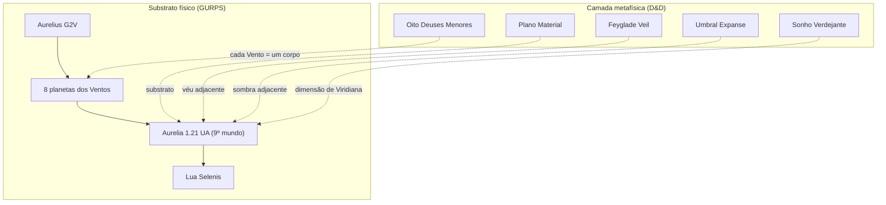

# Aurelia — Sistema Solar (GURPS Space)

Ficha astronômica do mundo **Aurelia** e seu sistema solar, derivada retroativamente com as regras de **GURPS Space** a partir do lore canônico. Descreve o **substrato físico** sobre o qual se assenta o Plano Material — separado da camada metafísica (planos, divindades, magia).

> **Método:** Steps 1–14 (mundo) → Steps 15–30 (sistema solar), escolhendo parâmetros onde o lore é explícito e derivando o restante para manter coerência física.

---

## 1. Conceito (Step 1)

**Aurelia** é um mundo **Standard (Garden)** — habitável, com oceanos de água líquida, atmosfera respirável e clima predominantemente temperado. Abriga civilizações antigas (elfos, anões) e o Império Humano moderno. O calendário imperial sincroniza ano, estações e ciclos lunares com precisão ritual; os **Astrologoi Basilikai** atribuem essa ordem à vigília de **Auriana** sobre o cosmos mortal.

| Papel dramático | Descrição |
|-----------------|-----------|
| Mundo principal | Único foco de campanha; low fantasy com sobrenatural concentrado na capital |
| Calendário | 480 dias, 12 meses lunares de 40 dias — dado canônico fixo |
| Lua | Única; culto lunar (Auriana / **Ulmathar**) e marés cíclicas |

---

## 2. Aurelia — Parâmetros Físicos (Steps 2–7)

### Tipo e Atmosfera

| Parâmetro | Valor | Notas |
|-----------|-------|-------|
| **Tipo** | Standard (Garden) | Equivalente a Terra habitável |
| **Massa atmosférica** | 1,0 | Faixa típica GURPS (0,5–1,5) |
| **Composição** | N₂ + O₂ livre | Respirável; sem traço Marginal |
| **Pressão** | 1,0 atm | Standard |
| **Hidrografia** | **68%** | Oceanos extensos; continentes amplos para o Império |

### Clima Global

| Parâmetro | Valor |
|-----------|-------|
| **Temperatura média global** | **288 K** (~15 °C), clima Normal |
| **Inclinação axial** | **~18°** |
| **Período de rotação** | **24,0 h** |
| **Duração do dia solar** | ≈ 24,05 h |

**Fatores de temperatura (GURPS):**

| Fator | Valor |
|-------|-------|
| Absorção (A) | 0,88 |
| Efeito estufa (G) | 0,14 |
| Correção de corpo negro (C) | ~1,14 (efetiva; ver nota abaixo) |

> **Nota — insolação vs. temperatura observada:** A órbita de 1,21 UA produz temperatura de corpo negro **B ≈ 253 K**. A média global observada de **288 K** implica correção efetiva **~1,14**. Os astrônomos imperiais registram essa discrepância no *Codex Basilikai* e a interpretam como prova da ordem divina de Auriana sobre os ciclos terrestres.

### Tamanho e Gravidade

| Parâmetro | Valor |
|-----------|-------|
| **Densidade** | 1,0 (5,52 g/cm³) |
| **Diâmetro** | ~12.742 km |
| **Gravidade superficial** | 1,0 G |
| **Massa** | 1,0 M⊕ |
| **MMWR** | ~5 |

### Recursos e Habitabilidade

| Parâmetro | Valor |
|-----------|-------|
| **RVM** (valor de recursos) | +1 (Abundante) |
| **Habitabilidade** | 8 / 8 |
| **Afinidade** | 9 |

Justificativa do RVM: agricultura imperial, mineração (Ironvale, Silver Host), madeira (Stonewood), rotas marítimas (Seaforth).

---

## 3. Estrela Primária — Aurelius (Steps 15–18)

| Parâmetro | Valor |
|-----------|-------|
| **Nome cultura imperial** | *Aurelius* (o Sol); associado a **Auriana** |
| **Número de estrelas** | 1 |
| **Massa** | 1,0 M☉ |
| **Classe espectral** | **G2 V** |
| **Temperatura efetiva** | 5.800 K |
| **Luminosidade** | 1,0 L☉ |
| **Raio** | ~0,00465 UA (~1,0 R☉) |
| **Idade do sistema** | **~5,4 Ga** |
| **Estágio evolutivo** | Sequência principal |

---

## 4. Órbita de Aurelia (Steps 20, 30)

### Derivação do ano de 480 dias

Usando a lei de Kepler (GURPS Step 30):

```
P (anos) = √(R³ / M★)
480 dias = 1,314 anos orbitais
R = (1,314²)^(1/3) ≈ 1,21 UA
```

| Parâmetro | Valor |
|-----------|-------|
| **Raio orbital médio** | **1,21 UA** (~181 milhões km) |
| **Período orbital (sideral)** | **480 dias** |
| **Excentricidade** | 0,05 |
| **Temperatura de corpo negro** | **253 K** |

### Zonas orbitais de Aurelius

| Zona | Raio (UA) |
|------|-----------|
| Limite interno | 0,10 |
| Linha de gelo (snow line) | ~4,85 |
| Limite externo | 40,0 |

---

## 5. Lua — Selenis (Steps 30, satélite)

Única lua major; no culto imperial é o **olho de Auriana**; na tradição élfica, manifestação de **Ulmathar** / **Ithilthar**.

| Parâmetro | Valor |
|-----------|-------|
| **Tipo** | Tiny (Rock) |
| **Massa** | 0,012 M⊕ |
| **Diâmetro** | ~3.450 km |
| **Distância orbital** | ~580.000 km |
| **Período sideral** | **36,9 dias** |
| **Período sinódico** | **40,0 dias** |
| **Lock tidal** | Sim |
| **Força de maré (T)** | 0,54 |

### Sincronização calendário–lua

```
Período sinódico S = P_m × P_ano / (P_ano − P_m)
40 = 36,9 × 480 / (480 − 36,9)  ✓

Meses por ano = 480 / 40 = 12 (exato)
Meses siderais por ano = 480 / 36,9 ≈ 13,0
```

O alinhamento perfeito entre **ano**, **mês** e **ciclo lunar** é estatisticamente raro em sistemas naturais aleatórios. No lore, é tratado como **ordem sagrada** estabelecida na fundação do [[imperial-calendar|Imerologion Basilikon]] — não como acaso.

---

## 6. Sistema Solar Completo (Steps 21–24)

Arranjo **convencional** (gigantes gasosos além da linha de gelo). O sistema conta **nove planetas** — oito nomeados pelos **[[lesser-gods|Oito Deuses Menores]]** (um Vento cada) e **Aurelia** como nono corpo: o mundo mortal onde os Ventos *atuam*, mas que não pertence a nenhum deles.

> **Regra de nomeação:** **9 planetas** no total. **8** levam o nome de um Deus Menor. **Aurelia** é o nono — assento das almas de Viridiana e palco da campanha; os Astrologoi a tratam como *o Mundo*, não como mais um Vento.

### Os Nove Mundos

| # | Nome | Tipo GURPS | Órbita (UA) | Período | Notas |
|---|------|------------|-------------|---------|-------|
| — | **Aurelius** | G2 V | 0 | — | Estrela primária; associada a Auriana |
| 1 | Zaralon | Standard (Chthonian) | 0,38 | ~95 d | Mais próximo do sol; fogo, calor devorador |
| 2 | Elyndra | Standard (Greenhouse) | 0,72 | ~252 d | Brilho intenso no crepúsculo; luz e ordem revelada |
| 3 | Sylvara | Standard (Ocean) | 1,02 | ~403 d | Oceanos sem terra emergida; ciclos de vida em estado puro |
| 4 | **Aurelia** | **Standard (Garden)** | **1,21** | **480 d** | Mundo mortal; império, almas dispersas |
| 5 | Thalvok | Small (Rock) | 1,55 | ~686 d | Deserto árido; natureza selvagem sem mediação |
| 6 | Khorvyn | Small (Rock) | 2,15 | ~1.140 d | Mundo denso, rico em minérios; superfície estéril |
| 7 | Astrael | Gas Giant (Medium) | 5,2 | ~11,9 a | Tempestades gigantescas; ar, vento, estrelas |
| 8 | Morthys | Gas Giant (Large) | 9,8 | ~30,7 a | Gigante distante e frio; passagem, fim dos ciclos |
| 9 | Voryn | Small (Ice) dwarf | 28 | ~165 a | Mundo oculto nos confins; sombra e segredos |

*Além dos nove planetas, um **cinturão de detritos** orbita entre Khorvyn e Astrael (~2,8 UA), interpretado como fragmentos arrancados de Khorvyn em eras primordiais — campo de asteroides, não planeta.*

**Arranjo de gigantes gasosos:** Convencional (ambos além da linha de gelo).

### Nomes por cultura (planetas)

| Corpo | Imperial / comum | Élfico | Anão | Halfling |
|-------|------------------|--------|------|----------|
| Zaralon | Zaralon | Caelathar | Thargrund | Blazefor |
| Elyndra | Elyndra | Lirael | Anvarn | Sunbright |
| Sylvara | Sylvara | Lothiriel | Thalvora | Greenglen |
| **Aurelia** | **Aurelia** | *Aurelia* | *Aurelia* | *Aurelia* |
| Thalvok | Thalvok | Rhuvenar | Hargrom | Wildkin |
| Khorvyn | Khorvyn | Narvenor | Duragoth | Stonehearth |
| Astrael | Astrael | Eryndor | Zarakul | Skystar |
| Morthys | Morthys | Faelyth | Durhal | Nightshade |
| Voryn | Voryn | Ulthryn | Thazrak | Duskmurk |

### Notas narrativas

- **Zaralon:** inatingível; calor de forja em escalas planetárias. Cultos marciais o invocam ao observá-lo ao entardecer.
- **Elyndra:** estrela vespertina/matutina mais brilhante; associada a julgamentos e juramentos públicos.
- **Sylvara:** visível como esfera azul-esverdeada; eruditos a descrevem como o Vento em estado bruto — vida sem mortais. Ninguém pisa lá (P3).
- **Aurelia:** único mundo com civilizações; os Oito Ventos *influenciam* cada domínio no planeta, mas nenhum o *é*.
- **Thalvok:** alvo de expedições perdidas; ruínas pré-imperiais no hemisfério visível.
- **Khorvyn:** superfície inabitável; mineração lendária no planeta e no cinturão de detritos adjacente (P4).
- **Astrael:** tempestades visíveis mesmo a olho nu; **Storm-readers** de [[north-alba]] invocam Astrael nas tempestades de Kalymfall.
- **Morthys:** observado nas vigílias funerárias; gigante lento, quase fixo no horizonte das eras.
- **Voryn:** planeta dos confins; dificilmente visível; eruditos debatem se sua órbita é estável ou se *escolhe* quando aparecer (P3).

---

## 7. Clima Regional — Validação com Lore

Parâmetros globais acima são média planetária. O Império ocupa latitudes médias; fronteiras extremam.

| Região | Latitude aprox. | Clima | Compatível com lore? |
|--------|-----------------|-------|----------------------|
| Coração imperial (Celestra) | ~48–52°N | Temperado continental | ✓ Verões amenos, invernos frios |
| Seaforth (sul) | ~42–45°N | Marítimo temperado | ✓ Invernos brandos, tempestades |
| Ironvale (noroeste) | ~52–56°N | Montanhoso frio | ✓ Mineração, invernos rigorosos |
| Stonewood (oeste) | ~50–54°N | Florestas temperadas | ✓ |
| North Alba / Black Hollow | ~58°N | Marítimo subárctico | ✓ Média ~6 °C; ver tabela abaixo |
| Silver Host | ~55–58°N | Alpino / fortificado | ✓ |

### North Alba — referência canônica

Dados de [[north-alba]] validam o modelo com inclinação axial de ~18°:

| Estação (mês imperial) | Luz diurna | Temp. alta média |
|------------------------|------------|------------------|
| Nyxweave (solstício de inverno) | ~7 h | 2 °C |
| Basilissalight (solstício de verão) | ~18 h | 15 °C |
| Kalymfall (inverno; boletins BH) | ~7 h 40 min | 0 a 3 °C |

---

## 8. Camadas de Realidade — GURPS × Cosmologia



| Camada | O que explica |
|--------|---------------|
| **GURPS Space** | Gravidade, atmosfera, órbitas, marés, clima físico |
| **[[lesser-gods]]** | Por que existem **oito** planetas dos Ventos **mais Aurelia** como nono mundo; cada Vento *é* seu domínio astronômico |
| **Cosmologia Aurelia** | Por que a lua sincroniza com o calendário; por que Ulmathar *é* a lua; planos sobrepostos |
| **Mitos (P1–P5)** | Viridiana dividiu seu Poder nos Oito antes do sacrifício; os corpos celestes são a assinatura dessa divisão |

Não há contradição se GURPS descreve o **mecanismo** e a cosmologia descreve o **significado**.

---

## 9. Resumo — Planetary Record Sheet

### Aurelia

| Campo | Valor |
|-------|-------|
| World Type | Standard (Garden) |
| Atmosphere | Standard, breathable |
| Hydrographics | 68% |
| Average Surface Temp | 288 K (Normal) |
| Axial Tilt | ~18° |
| Density | 1,0 |
| Diameter | ~12.742 km |
| Surface Gravity | 1,0 G |
| Mass | 1,0 M⊕ |
| Rotation Period | 24,0 h |
| Orbital Radius | 1,21 AU |
| Orbital Period | 480 days |
| Primary Star | Aurelius (G2 V, 1,0 M☉, 5,4 Ga) |
| Major Moon | Selenis (sinódico 40 d, sideral 36,9 d) |
| Habitability | 8 |
| Affinity | 9 |
| RVM | +1 |

---

## 10. Notas de Design e Tensões Menores

| Item | Status | Resolução |
|------|--------|-----------|
| Ano de 480 dias → órbita 1,21 UA | ✓ Coerente | Derivado por Kepler |
| Lua sinódica de 40 dias | ✓ Coerente | Órbita lunar a ~73 D⊕ |
| Calendário perfeitamente sincronizado | ⚠ Raro naturalmente | Explicado como ordem divina / fundação imperial |
| B = 253 K vs. média global 288 K | ⚠ Gap de ~35 K | Correção atmosférica efetiva ~1,14; registro imperial + interpretação sagrada |
| Latitude 58°N com 7 h 40 min de inverno | ✓ Coerente com tilt 18° | Tilt ligeiramente menor que Terra (23,4°) |

---

## 11. Referências Internas

- [[imperial-calendar]] — estrutura de 480 dias, fases lunares, semana de 8 dias
- [[geography-of-the-empire]] — climas regionais e macrogeografia
- [[north-alba]] — dados climáticos de validação (58°N, marés, estações)
- [[lesser-gods]] — Os Oito Deuses Menores e a nomeação dos corpos orbitais
- [[ulmathar]] — divindade lunar
- [[divine-hierarchy]] — Auriana e a ordem cósmica imperial
- [[creation]] — formação do Plano Material a partir do Caos

---

*Derivado com GURPS Space (SJ Games). Parâmetros fixados pelo lore canônico; demais valores calculados para coerência física interna.*
